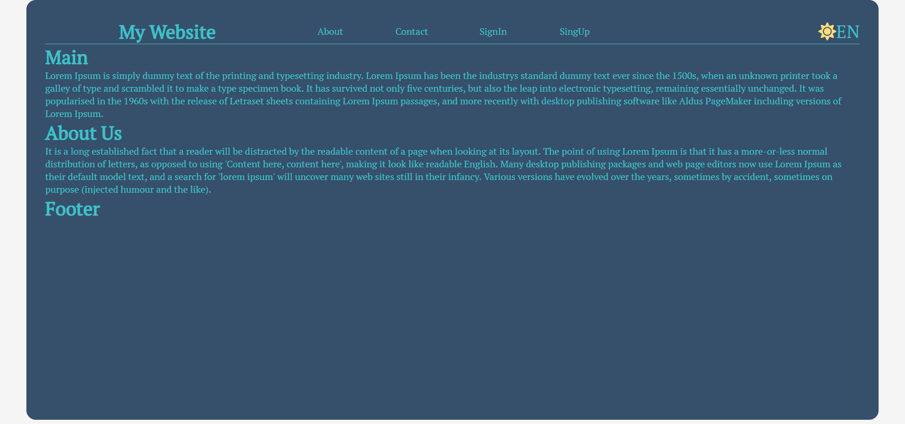
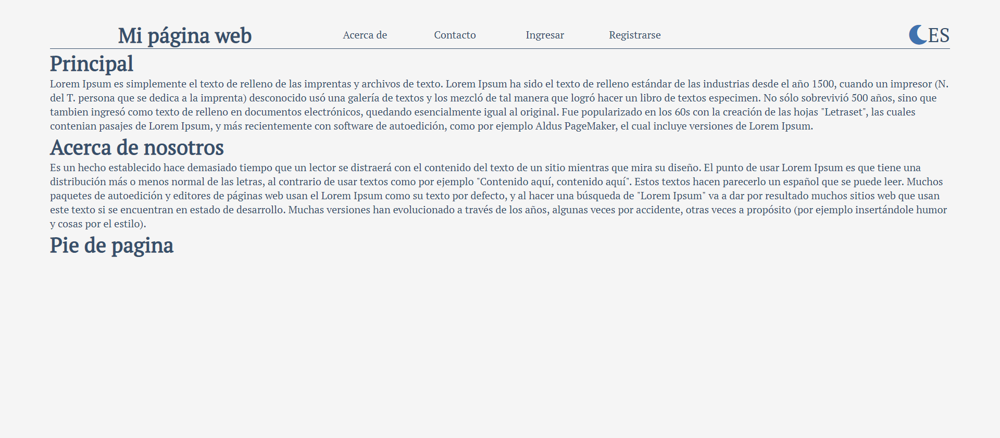

<h1 align="center">
  Multi-lingual - Multi-themed boilerplate
</h1>

Simple unpolished website experimenting with useContext hook in order to benefit from a multilingual / multitheme website..

<a>

  

